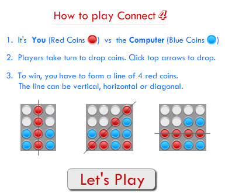
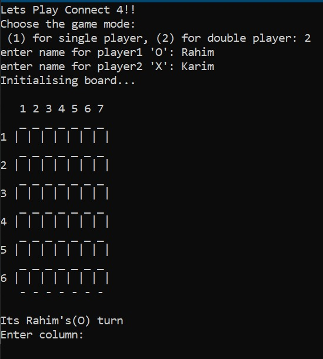
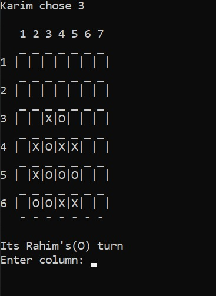
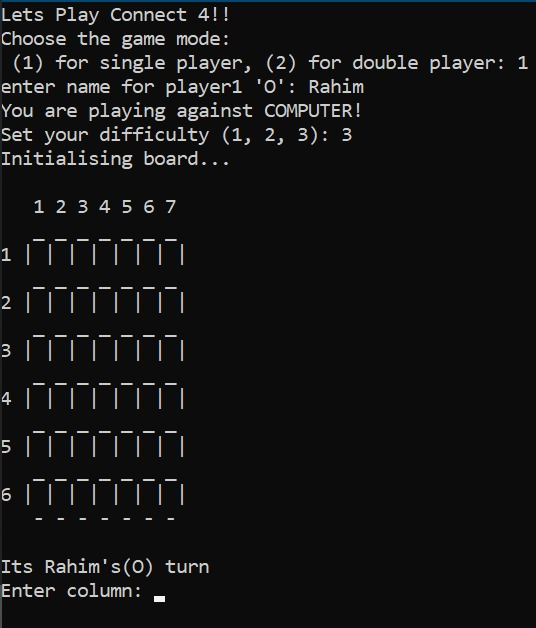
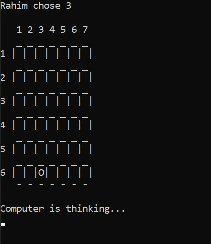

<h2 align="center">
<table align="center">
<tr>
<td>Team X</td>
</tr>
<tr>
<td>Connect 4</td>
</tr>
</table>

</h2>

<h2><b>Connect 4:</b></h2>

Connect-Four is a tic-tac-toe-like two-player game in which players alternately place pieces on a vertical board 7 columns across and 6 rows high. Each player uses pieces of a particular color (commonly black and red, or sometimes yellow and red), and the object is to be the first to obtain four pieces in a horizontal, vertical, or diagonal line. Because the board is vertical, pieces inserted in a given column always drop to the lowest unoccupied row of that column. As soon as a column contains 6 pieces, it is full and no other piece can be placed in the column.

 

 

Both players begin with 21 identical pieces, and the first player to achieve a line of four connected pieces wins the game. If all 42 shots are played and no player has places four pieces in a row, the game is drawn.

 

<h2><b>Our Project:</b></h2>
 
❖ In this project, we plan to create a digital version of the classic Connect 4 game entirely coded in C.
  
❖ The baseline project is that we build a command line version of the game, which prints the Board Layout, the Player Symbols, and any prompts or messages in plain ASCII text.
  
❖ It has two mode. 
    
1. <b>Multi Player Mode:</b> <i>It would facilitate 2 human players to play the game.</i>  

2. <b>Single Player Mode:</b> <i>One player would play against an AI bot built using the minimax algorithm.</i>  

  

❖ Possible enhancements would include a proper GUI to the game with appropriate animations, using the graphics.h header-file.

 

<h2><b>Team X:</b></h2>
<table align="center" width="600" border="2">
<caption>Team Member</caption>
<tr>
    <td>Name</td>
    <td>Registration No.</td>
</tr>
<tr>
    <td>Sakibul Islam</td>
    <td>2019831062</td>
</tr>
<tr>
    <td>Mahir Al Shahriar</td>
    <td>2019831077</td>
</tr>
<tr>
    <td>Zawadul Karim</td>
    <td>2019831064</td>
</tr>
<tr>
    <td>Naimur Rahman</td>
    <td>2019831079</td>
</tr>
<tr>
    <td>Md. Sabbir Hossin</td>
    <td>2019831037</td>
</tr>
</table>

 

<h3 align="center"><b>Team X</b></h3>